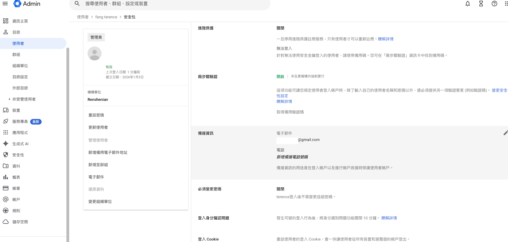
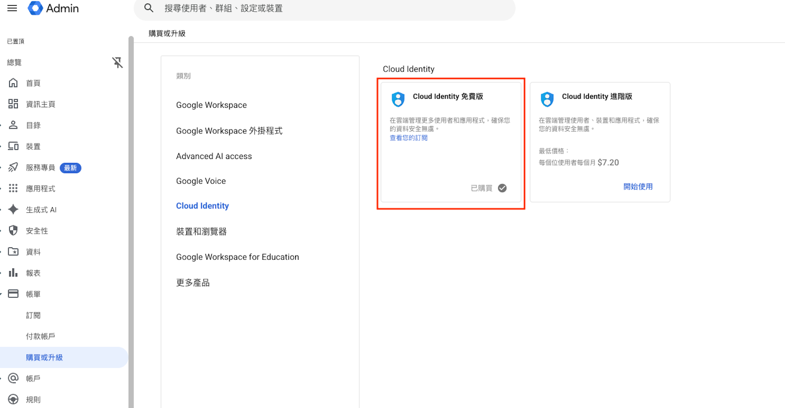
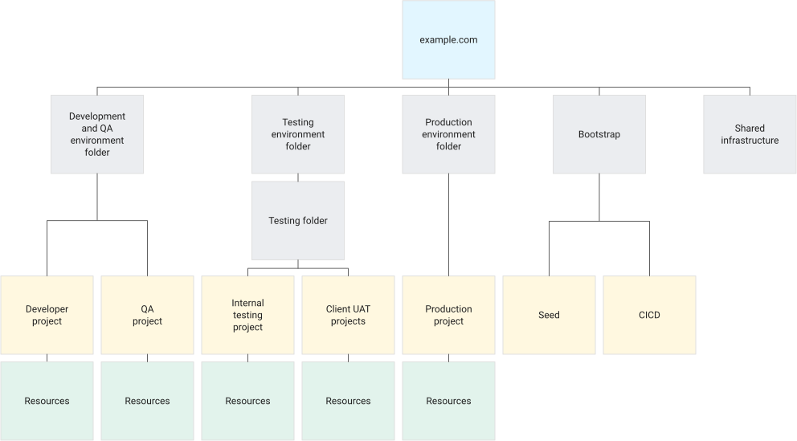
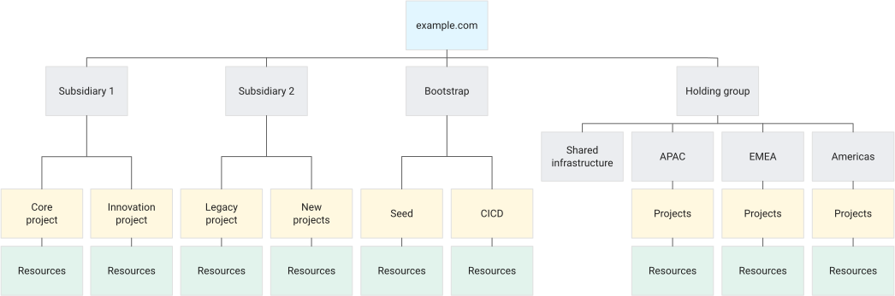
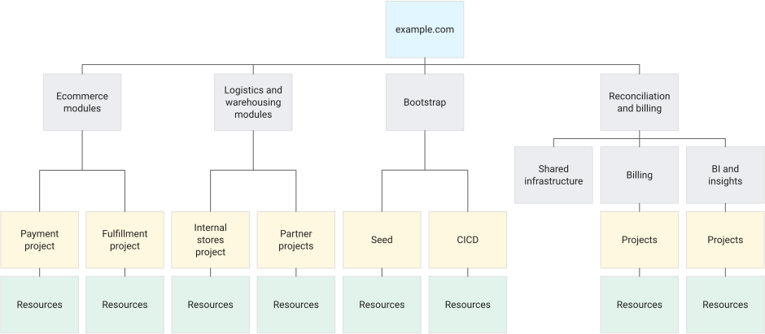

# Google Cloud Enterprise-Tier Onboarding Workflow

 

## 1. 使用一個 Domain name 註冊 Cloud Identity

### 1.1 驗證 Domain & 初始化 Cloud Identity

Cloud Identity 是 GCP 使用者帳號的來源之一。最重要的是，GCP Organization 組織層級以及超級管理員都來自於 Cloud Identity 這個主體。
依照 Google 的註冊精靈完成網域驗證（透過在 DNS 新增指定的 TXT record，或上傳 Google 提供的 HTML 驗證檔）之後，就會建立好 Cloud Identity 帳戶並進入 Cloud Identity console。

> [!NOTE]
如果網域註冊遇到已經被註冊的問題，可以用以下連結請 Google 協助。
> https://toolbox.googleapps.com/apps/recovery/domain_in_use

進到 Cloud Identity console 後，接著幫超級管理員(目前在使用的 User) 設定以下：
- 兩步驟驗證
- 備援資訊-備援信箱跟電話
- 硬體安全金鑰（Security Key，例如 Titan Security Key、YubiKey；比簡訊或 Authenticator App 更能防止釣魚與 SIM 卡竊取）

> [!IMPORTANT]
Super Admin 帳號等同於整個 Cloud Identity / GCP Organization 的最高權限，建議額外建立 1~2 組 **Break-glass 緊急存取帳號**：
> - 帳號不綁定既有 SSO/Idp（例如 Entra ID），直接在 Cloud Identity 建立獨立密碼並搭配硬體安全金鑰，避免 Idp 系統故障或設定錯誤時完全無法登入管理 GCP。
> - 帳密與金鑰實體妥善保管（例如企業密碼管理系統 + 保險櫃），並設定登入時的異常告警通知（email/Slack），平時不使用，僅在緊急情況下啟用。
> - 定期（例如每季）演練登入流程，確保真的緊急狀況發生時可以使用。

 

要去訂閱 Cloud Identity 免費版。這樣之後要在 Cloud Identity 新增 User 或是 Idp 人員同步才有 License quota 可以用。

### 1.2 決定 User 來源 & 建立群組與人員

#### User 來源

對於很多公司來說，已經有 Identity Provider (a.k.a Idp) 系統，而 Cloud Identity 也是一種 Idp。所以在讓內部人員使用 GCP 前要確認 User account 是要源自於既有的 Idp 還是直接從 Cloud Identity 中建立 User account。

- 如果是直接用 Cloud Identity 建立 User account，那就直接在 Cloud Identity console 建立群組及使用者。
- 如果是要用既有的 Idp，那就根據 Google 官方及既有的 Idp 官方說明文件進行同步跟整合授權流程。

> [!TIP]
> [Entra ID 佈建使用者/群組至 Google Cloud Identity 並設定 SSO 部署與維護 SOP](https://github.com/terensy/entraid-cloudidentity-provisioning-sso-sop.git)

#### 群組規劃

通常不管在地端環境或是雲端環境我們都習慣用群組的方式管理權限，因為可以有效率且有邏輯的管理每一個使用者的角色跟權限。因此在決定好使用者來源後就要規劃群組，可以根據 [Google 官方提供的群組規劃範例](https://docs.cloud.google.com/architecture/blueprints/security-foundations/authentication-authorization?hl=zh-tw#groups_for_access_control) 或是目前其他系統的群組劃分邏輯進行。

在細部規劃群組架構之前，至少要先建立以下幾個**最小必要的管理群組**，因為第 2 章會直接在 GCP IAM 層級把角色權限指派給它們：

| 群組（命名範例） | 用途 | 之後在 GCP IAM 常對應的角色 |
| --- | --- | --- |
| gcp-organization-admins@ | 管理 GCP Organization 層級設定、Folder/Project 階層 | Organization Administrator |
| gcp-billing-admins@ | 管理 Billing 帳戶、預算與成本控管 | Billing Account Administrator |
| gcp-network-admins@ | 管理共用網路（Shared VPC）、防火牆、混合連線 | Network Admin、Compute Network Admin |
| gcp-security-admins@ | 管理 Organization Policy、IAM 稽核、Security Command Center | Organization Policy Administrator、Security Admin |
| gcp-logging-admins@ | 管理集中式 Log sink、稽核紀錄與監控告警 | Logs Configuration Writer、Monitoring Admin |

上述群組建立後先只加入負責初始化的少數人員（例如目前的超級管理員或 IT 負責人），等第 2 章完成 GCP IAM 角色指派後，再依實際負責人調整成員；建議之後把超級管理員從日常使用中移除，只保留在 [Break-glass 緊急存取帳號](#11-驗證-domain--初始化-cloud-identity) 的管理範圍內，降低最高權限帳號的日常曝險。

> [!IMPORTANT]
> 不管是 GCP、AWS、Azure 或是其他公有雲都是先知道其基礎知識，再回顧公司內的組織結構或是系統管理層級才可以有效規劃群組。請記住一句話【沒有人比你更了解你的公司】，所以請不要一開始就找合作公司替你處理使用者及群組規劃，應該先自行規劃一版再尋求 Best Practice 建議。

> [!IMPORTANT]
> 在 Cloud Identity 中建立的 User account 或是群組，雖然可以設定權限，但是那是控制 Cloud Identity 這個 Idp 的權限跟其他 Google 服務的使用權限，不是 GCP 的。CP 權限是要在 GCP IAM console 中設定。

 

## 2. GCP Organization 層級初始化設定

當超級管理員登入到 GCP console，最重要的一件事是幫剛剛建立的 User account 或是群組給予對應角色所需要的權限。完成之後就可以登出超級管理員交給對應角色的內部人員進行 GCP 初始化設定或使用。

### 2.1 建立 GCP Folder & Project

建立 GCP Folder 是為了有組織的管理跟劃分 GCP Project，另外就是以 Folder 為單位的給予組織政策或是使用者或群組權限。

- 可以 [根據應用程式環境建立階層](https://docs.cloud.google.com/architecture/landing-zones/decide-resource-hierarchy?hl=zh-tw#option1)

- 也可以 [按區域或子公司建立階層](https://docs.cloud.google.com/architecture/landing-zones/decide-resource-hierarchy?hl=zh-tw#option2)

- 或是 [根據問責架構建立階層](https://docs.cloud.google.com/architecture/landing-zones/decide-resource-hierarchy?hl=zh-tw#option3)

階層規劃沒有一定的答案，可以根據內部所需規劃甚至也可以不用 GCP Folder，全憑公司內部對於系統服務上的管理政策。不論選擇上述哪一種模式，通常都會額外規劃一個共用服務用的 Folder，把網路、Audit Log、CI/CD 等共用元件集中管理，再往下依所選模式展開各應用/環境/子公司的 Folder。GCP Folder 階層建立完成後就可以在裡面建立所需要的 GCP Project 開始使用 GCP 服務了。

最後，如果對於 GCP Folder、Project 命名有困難，可以參考 [Google 規劃的 Folder 跟 Project 命名規則](https://docs.cloud.google.com/architecture/blueprints/security-foundations/summary?hl=zh-tw#naming-conventions)

### 2.2 規劃 GCP Organization Policies

GCP Organization Policies 主要是讓管理員在機構、資料夾或專案層級設定統一的限制條件（constraints），例如限制資源建立地區、限制對外資料分享、限制可用服務等。政策會自動繼承到 Folder/Project，也能在下層覆寫。簡單說就是幫整個 GCP 環境設下治理護欄，讓團隊在合規範圍內自由運作。

基本上當 GCP Organization 啟用後已經有 [預設 Organization Policies](https://docs.cloud.google.com/organization-policy/reference/org-policy-constraints#automatically_enforced_constraints) 啟用。如果公司政策需要符合基本的 CIS Benchmark，可以參考本 repo 整理的 [GCP Organization Policy 對照表](org-policies-cis-benchmark/gcp_org_policy_catalog.csv)（依據 [CIS Google Cloud Platform Foundation Benchmark v5.0.0](org-policies-cis-benchmark/CIS_Google_Cloud_Platform_Foundation_Benchmark_v5.0.0.pdf) 整理）挑選需要額外設定的 Organization Policies。

🚧 TODO：更完整的 GCP Organization Policies 設定教學（各 constraint 適用情境、如何用 gcloud/Terraform 套用）將另外整理成獨立文件補充，目前先以上述對照表作為起點。

### 2.3 VPC-SC