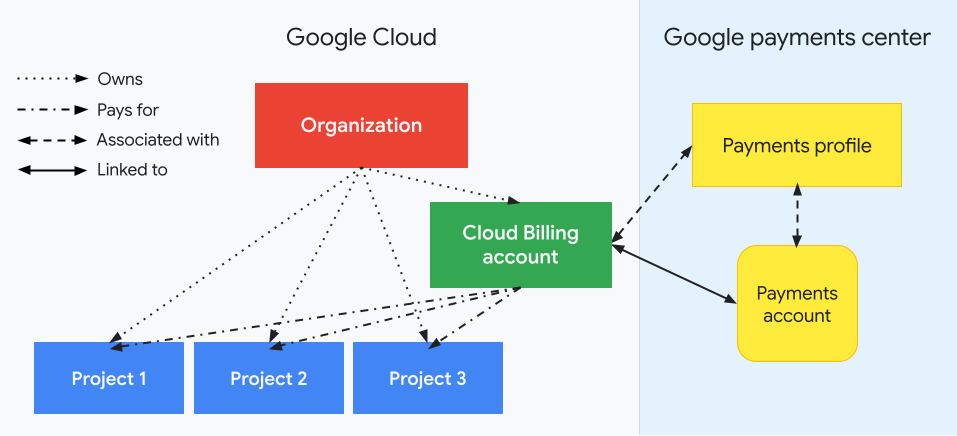
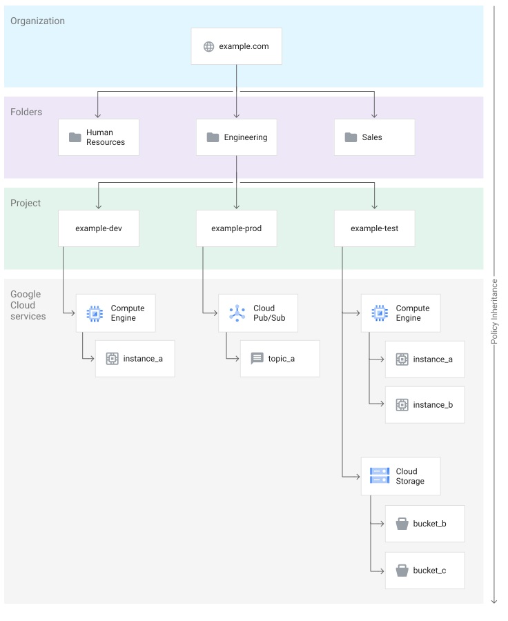
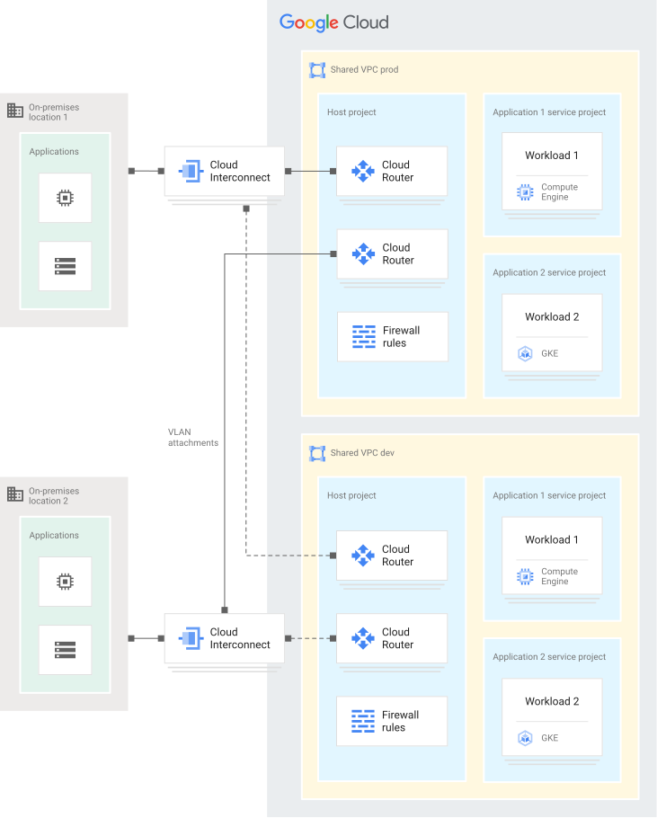
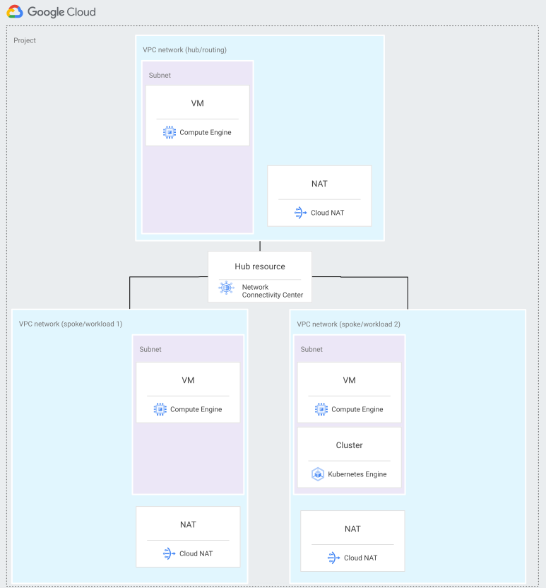
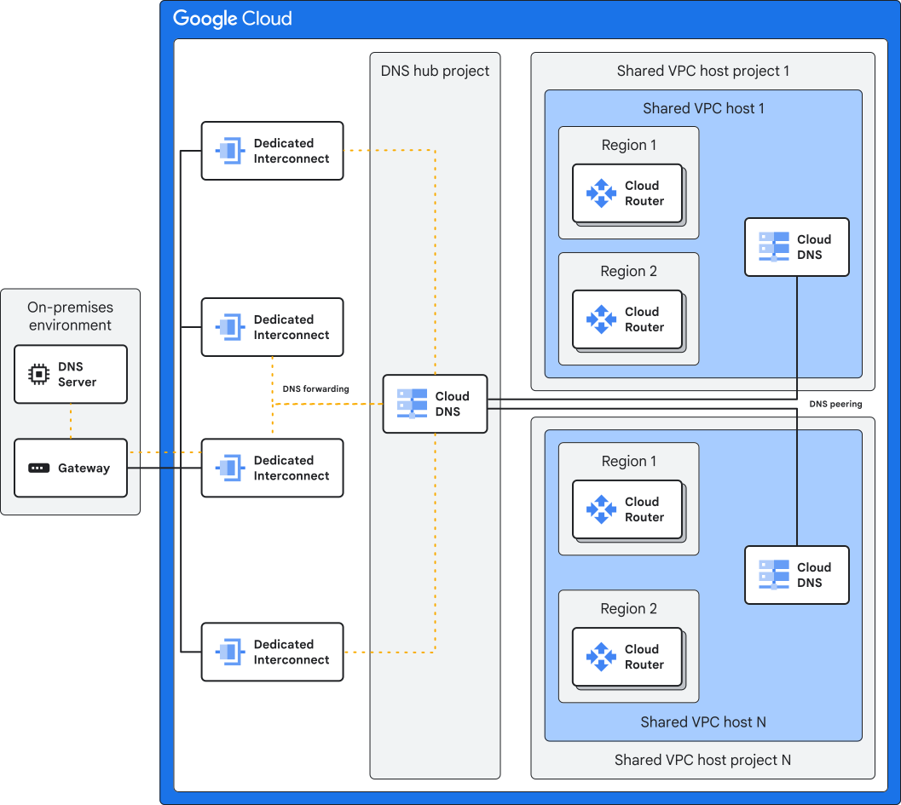
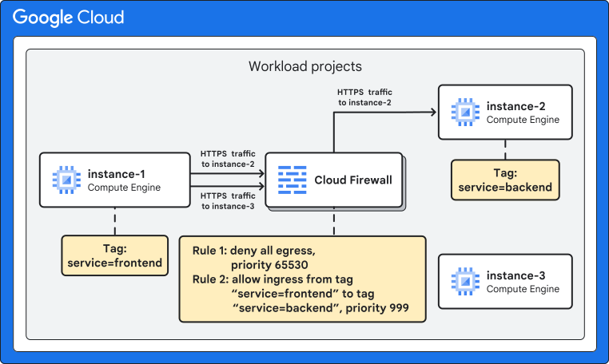
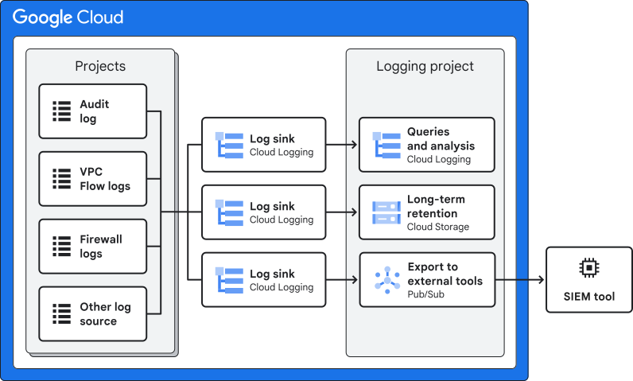
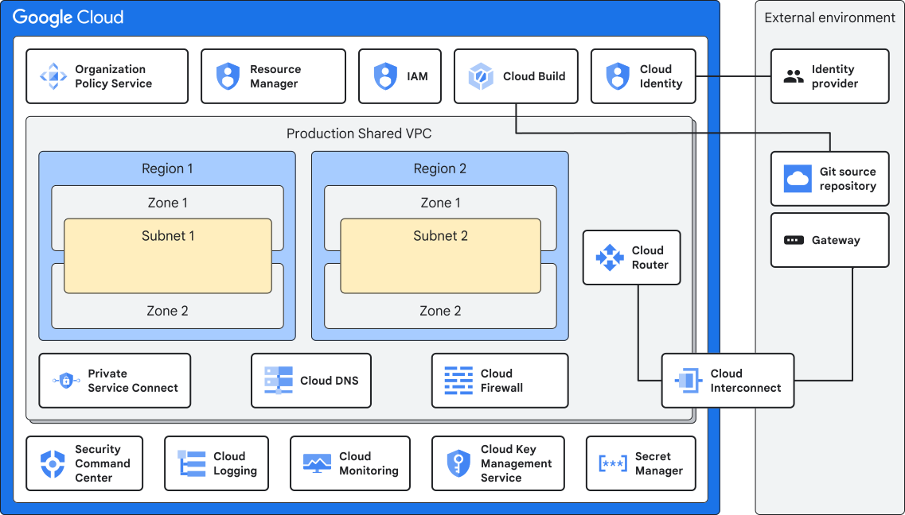
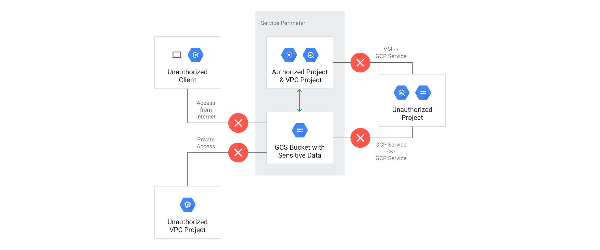
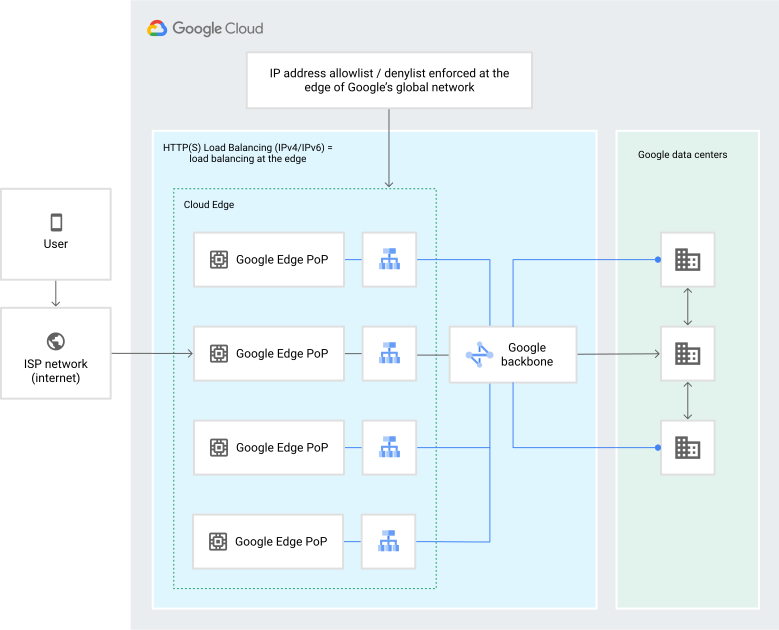

# Google Cloud Enterprise-Tier Onboarding Workflow

> [!TIP]
> **中小型企業第一次導入 GCP？** 這份文件是完整的企業級導入流程，涵蓋多環境、完整合規政策等大型企業才需要的複雜度。如果只需要一套「不做會出事、做了成本可控」的最小可用架構，直接看 [sme-quickstart/](sme-quickstart/)——精簡版 Terraform，一次 `terraform apply` 佈出 Folder/Project、Organization Policies 子集、IAM、Shared VPC（含選用的 VPN）、集中稽核 Logging，且升級路徑直接沿用本文件底下各章節的企業版子專案，不需要重寫架構。

## 目錄

- [1. 使用一個 Domain name 註冊 Cloud Identity](#1-使用一個-domain-name-註冊-cloud-identity)
  - [1.1 驗證 Domain & 初始化 Cloud Identity](#11-驗證-domain--初始化-cloud-identity)
  - [1.2 決定 User 來源 & 建立群組與人員](#12-決定-user-來源--建立群組與人員)
- [2. GCP Organization 層級初始化設定](#2-gcp-organization-層級初始化設定)
  - [2.1 建立 GCP Folder & Project](#21-建立-gcp-folder--project)
  - [2.2 規劃 GCP Organization Policies](#22-規劃-gcp-organization-policies)
  - [2.3 Billing 帳戶設定與治理](#23-billing-帳戶設定與治理)
  - [2.4 IAM 角色指派](#24-iam-角色指派)
- [3. GCP 網路設計](#3-gcp-網路設計)
  - [3.1 網路架構設計](#31-網路架構設計)
  - [3.2 混合雲連線](#32-混合雲連線)
  - [3.3 私有存取與 Cloud DNS](#33-私有存取與-cloud-dns)
  - [3.4 Cloud NAT](#34-cloud-nat)
  - [3.5 Firewall 管理](#35-firewall-管理)
- [4. Log 管理](#4-log-管理)
  - [4.1 Cloud Audit Logs](#41-cloud-audit-logs)
  - [4.2 集中式 Log Sink](#42-集中式-log-sink)
  - [4.3 保留政策與費用](#43-保留政策與費用)
- [5. 安全性相關產品](#5-安全性相關產品)
  - [5.1 Security Command Center (SCC)](#51-security-command-center-scc)
  - [5.2 VPC Service Controls (VPC-SC)](#52-vpc-service-controls-vpc-sc)
  - [5.3 Cloud KMS（CMEK）](#53-cloud-kmscmek)
  - [5.4 Secret Manager](#54-secret-manager)
  - [5.5 Cloud Armor](#55-cloud-armor)
  - [5.6 Binary Authorization](#56-binary-authorization)
  - [5.7 Assured Workloads（合規限定場景）](#57-assured-workloads合規限定場景)
- [6. 備份與災難復原策略](#6-備份與災難復原策略)
  - [6.1 原生服務內建的備份機制](#61-原生服務內建的備份機制)
  - [6.2 Backup and DR Service](#62-backup-and-dr-service)
  - [6.3 RPO / RTO 規劃](#63-rpo--rto-規劃)
- [7. Infrastructure as Code 基礎建設](#7-infrastructure-as-code-基礎建設)
- [8. 其他治理事項](#8-其他治理事項)
  - [8.1 資源 Tagging / Labeling 策略](#81-資源-tagging--labeling-策略)
  - [8.2 Google Cloud Support Plan](#82-google-cloud-support-plan)

 

## 1. 使用一個 Domain name 註冊 Cloud Identity

### 1.1 驗證 Domain & 初始化 Cloud Identity

Cloud Identity 是 GCP 使用者帳號的來源之一。最重要的是，GCP Organization 組織層級以及超級管理員都來自於 Cloud Identity 這個主體。
依照 Google 的註冊精靈完成網域驗證（透過在 DNS 新增指定的 TXT record，或上傳 Google 提供的 HTML 驗證檔）之後，就會建立好 Cloud Identity 帳戶並進入 Cloud Identity console。

> [!NOTE]
如果網域註冊遇到已經被註冊的問題，可以用以下連結請 Google 協助。
> https://toolbox.googleapps.com/apps/recovery/domain_in_use

進到 Cloud Identity console 後，接著幫超級管理員(目前在使用的 User) 設定以下：
- 兩步驟驗證
- 備援資訊-備援信箱跟電話
- 硬體安全金鑰（Security Key，例如 Titan Security Key、YubiKey；比簡訊或 Authenticator App 更能防止釣魚與 SIM 卡竊取）

> [!IMPORTANT]
Super Admin 帳號等同於整個 Cloud Identity / GCP Organization 的最高權限，建議額外建立 1~2 組 **Break-glass 緊急存取帳號**：
> - 帳號不綁定既有 SSO/Idp（例如 Entra ID），直接在 Cloud Identity 建立獨立密碼並搭配硬體安全金鑰，避免 Idp 系統故障或設定錯誤時完全無法登入管理 GCP。
> - 帳密與金鑰實體妥善保管（例如企業密碼管理系統 + 保險櫃），並設定登入時的異常告警通知（email/Slack），平時不使用，僅在緊急情況下啟用。
> - 定期（例如每季）演練登入流程，確保真的緊急狀況發生時可以使用。

 

要去訂閱 Cloud Identity 免費版。這樣之後要在 Cloud Identity 新增 User 或是 Idp 人員同步才有 License quota 可以用。

### 1.2 決定 User 來源 & 建立群組與人員

#### User 來源

對於很多公司來說，已經有 Identity Provider (a.k.a Idp) 系統，而 Cloud Identity 也是一種 Idp。所以在讓內部人員使用 GCP 前要確認 User account 是要源自於既有的 Idp 還是直接從 Cloud Identity 中建立 User account。

- 如果是直接用 Cloud Identity 建立 User account，那就直接在 Cloud Identity console 建立群組及使用者。
- 如果是要用既有的 Idp，那就根據 Google 官方及既有的 Idp 官方說明文件進行同步跟整合授權流程。

> [!TIP]
> [Entra ID 佈建使用者/群組至 Google Cloud Identity 並設定 SSO 部署與維護 SOP](https://github.com/terensy/entraid-cloudidentity-provisioning-sso-sop.git)

#### 群組規劃

通常不管在地端環境或是雲端環境我們都習慣用群組的方式管理權限，因為可以有效率且有邏輯的管理每一個使用者的角色跟權限。因此在決定好使用者來源後就要規劃群組，可以根據 [Google 官方提供的群組規劃範例](https://docs.cloud.google.com/architecture/blueprints/security-foundations/authentication-authorization?hl=zh-tw#groups_for_access_control) 或是目前其他系統的群組劃分邏輯進行。

在細部規劃群組架構之前，至少要先建立以下幾個**最小必要的管理群組**，因為第 2 章會直接在 GCP IAM 層級把角色權限指派給它們：

| 群組（命名範例） | 用途 | 之後在 GCP IAM 常對應的角色 |
| --- | --- | --- |
| gcp-organization-admins@ | 管理 GCP Organization 層級設定、Folder/Project 階層 | Organization Administrator |
| gcp-billing-admins@ | 管理 Billing 帳戶、預算與成本控管 | Billing Account Administrator |
| gcp-network-admins@ | 管理共用網路（Shared VPC）、防火牆、混合連線 | Network Admin、Compute Network Admin |
| gcp-security-admins@ | 管理 Organization Policy、IAM 稽核、Security Command Center | Organization Policy Administrator、Security Admin |
| gcp-logging-admins@ | 管理集中式 Log sink、稽核紀錄與監控告警 | Logs Configuration Writer、Monitoring Admin |

上述群組建立後先只加入負責初始化的少數人員（例如目前的超級管理員或 IT 負責人），等第 2 章完成 GCP IAM 角色指派後，再依實際負責人調整成員；建議之後把超級管理員從日常使用中移除，只保留在 [Break-glass 緊急存取帳號](#11-驗證-domain--初始化-cloud-identity) 的管理範圍內，降低最高權限帳號的日常曝險。

> [!IMPORTANT]
> 不管是 GCP、AWS、Azure 或是其他公有雲都是先知道其基礎知識，再回顧公司內的組織結構或是系統管理層級才可以有效規劃群組。請記住一句話【沒有人比你更了解你的公司】，所以請不要一開始就找合作公司替你處理使用者及群組規劃，應該先自行規劃一版再尋求 Best Practice 建議。

> [!IMPORTANT]
> 在 Cloud Identity 中建立的 User account 或是群組，雖然可以設定權限，但是那是控制 Cloud Identity 這個 Idp 的權限跟其他 Google 服務的使用權限，不是 GCP 的。CP 權限是要在 GCP IAM console 中設定。

 

## 2. GCP Organization 層級初始化設定

當超級管理員登入到 GCP console，最重要的一件事是幫剛剛建立的 User account 或是群組給予對應角色所需要的權限。完成之後就可以登出超級管理員交給對應角色的內部人員進行 GCP 初始化設定或使用。

### 2.1 建立 GCP Folder & Project

建立 GCP Folder 是為了有組織的管理跟劃分 GCP Project，另外就是以 Folder 為單位的給予組織政策或是使用者或群組權限。

- 可以 [根據應用程式環境建立階層](https://docs.cloud.google.com/architecture/landing-zones/decide-resource-hierarchy?hl=zh-tw#option1)

- 也可以 [按區域或子公司建立階層](https://docs.cloud.google.com/architecture/landing-zones/decide-resource-hierarchy?hl=zh-tw#option2)

- 或是 [根據問責架構建立階層](https://docs.cloud.google.com/architecture/landing-zones/decide-resource-hierarchy?hl=zh-tw#option3)

階層規劃沒有一定的答案，可以根據內部所需規劃甚至也可以不用 GCP Folder，全憑公司內部對於系統服務上的管理政策。不論選擇上述哪一種模式，通常都會額外規劃一個共用服務用的 Folder，把網路、Audit Log、CI/CD 等共用元件集中管理，再往下依所選模式展開各應用/環境/子公司的 Folder。GCP Folder 階層建立完成後就可以在裡面建立所需要的 GCP Project 開始使用 GCP 服務了。

最後，如果對於 GCP Folder、Project 命名有困難，可以參考 [Google 規劃的 Folder 跟 Project 命名規則](https://docs.cloud.google.com/architecture/blueprints/security-foundations/summary?hl=zh-tw#naming-conventions)

### 2.2 規劃 GCP Organization Policies

GCP Organization Policies 主要是讓管理員在機構、資料夾或專案層級設定統一的限制條件（constraints），例如限制資源建立地區、限制對外資料分享、限制可用服務等。政策會自動繼承到 Folder/Project，也能在下層覆寫。簡單說就是幫整個 GCP 環境設下治理護欄，讓團隊在合規範圍內自由運作。

基本上當 GCP Organization 啟用後已經有 [預設 Organization Policies](https://docs.cloud.google.com/organization-policy/reference/org-policy-constraints#automatically_enforced_constraints) 啟用。如果公司政策需要符合基本的 CIS Benchmark，可以參考 [organization-policies/](organization-policies/) 這個子專案：

- [organization-policies/docs/policy_catalog.md](organization-policies/docs/policy_catalog.md) — 依據 [CIS Google Cloud Platform Foundation Benchmark v5.0.0](organization-policies/references/CIS_Google_Cloud_Platform_Foundation_Benchmark_v5.0.0.pdf) 整理的 33 項政策中英對照表。
- [organization-policies/docs/methodology.md](organization-policies/docs/methodology.md) — 如何依公司自己的風險與業務需求決定「哪些政策要開、開在哪個層級、值該填什麼」，而不是把 CIS 建議照單全收。
- [organization-policies/README.md](organization-policies/README.md) — 對應的 Terraform module，讀 `policies_catalog.yaml` 用 `for_each` 產生 `google_org_policy_policy` 資源，可直接 `terraform init/plan/apply` 套用。

### 2.3 Billing 帳戶設定與治理

Billing 帳戶是獨立於 Organization / Folder / Project 之外的另一個資源階層——這是最多人搞混的地方，很多人直覺以為 Billing 權限也是在 Organization IAM 那邊設定，結果找半天找不到，其實要去 Billing 帳戶自己的 IAM 頁籤設定。

[Google 官方 Billing 導入檢查清單](https://cloud.google.com/billing/docs/onboarding-checklist) 建議：

> [!TIP]
> 建立單一、集中的 Cloud Billing 帳戶掛在 Organization 底下就好，除非有法遵/會計分帳、幣別、或需要分開請款等具體理由，才需要拆成多個 Billing 帳戶。

#### 角色分工

| 角色 | 可以做什麼 | 給誰 |
|---|---|---|
| **Billing Account Administrator**（`roles/billing.admin`） | 管理付款方式、啟用 Billing Export、設定預算告警、**連結/解除連結專案**、管理其他人在這個 Billing 帳戶上的角色 | `gcp-billing-admins@`，通常是真正對損益負責的財務/IT 主管 |
| Billing Account User | 可以把專案**連結**到 Billing 帳戶，但不能解除連結 | 需要自助建立專案的團隊，搭配 Project Creator 角色 |
| Project Billing Manager（Project 層級角色） | 只能把自己有權限的專案，連去自己有 User 角色的 Billing 帳戶，對專案內資源沒有任何存取權 | 想讓團隊自助掛帳，又不想給完整 Billing 帳戶權限時使用 |

> [!IMPORTANT]
> Billing Account Administrator 的權限要綁在 Billing 帳戶本身（Terraform 資源是 `google_billing_account_iam_member`），不是 Organization——這兩個是獨立的資源階層，詳見 [iam-bindings/](iam-bindings/) 子專案。

#### 預算與告警

在 Billing 帳戶的「**Budgets & alerts**」設定預算，可以用實際花費或**預測花費**當觸發條件，預設門檻是 50% / 90% / 100%。告警除了寄信給 Billing Admin，也可以接 Pub/Sub 做自動化（例如超過門檻就自動停用某個測試專案的 Billing，避免忘記關的資源燒一整個月的錢）。

> [!CAUTION]
> 「Alerts only」的預算**不會**自動幫你把服務停掉或設用量上限，它只是寄信通知。這點很多甲方都會誤會，覺得設了預算等於有一個天花板，結果帳單照樣爆表，月底檢討會上才問「為什麼設了預算還是超支」。設預算只是讓你早一點發現問題，不是幫你踩剎車，真的要有用量上限，需要另外接 Pub/Sub 自動化去停用/降級資源。

#### Billing Export to BigQuery

建議專案初期就開啟 [Billing Export to BigQuery](https://cloud.google.com/billing/docs/how-to/export-data-bigquery)（至少開 Standard usage cost data，有明細分析需求再加開 Detailed usage cost data），因為 **Export 只會從開啟的當下開始收資料，沒辦法回溯**——很多團隊都是帳單已經出問題了才想到要開 Export，結果發現分析不了「過去」發生了什麼事，只能眼睜睜看著同樣的問題下個月再發生一次。

#### 成本歸屬

透過 [Labels](https://cloud.google.com/resource-manager/docs/labels-overview) 標記 `environment`、`cost-center`、`team` 等 key-value，Labels 會被帶進 Billing Export，可以回答「這個月 Database 花了多少錢」這類問題。完整的標籤治理策略見 [8.1 資源 Tagging / Labeling 策略](#81-資源-tagging--labeling-策略)。

### 2.4 IAM 角色指派

1.2 節建立的 5 個群組，這裡才是真正把權限「兌現」的地方。[Google IAM 安全性最佳實務](https://cloud.google.com/iam/docs/using-iam-securely) 講得很直白：

> [!IMPORTANT]
> 正式環境除非真的沒有其他選擇，不要授予 Basic role（Owner / Editor / Viewer）。優先用 Google 維護的 Predefined role，把角色綁在**群組**而不是個人帳號上——[Google 自家的 Enterprise Foundations Blueprint](https://cloud.google.com/architecture/blueprints/security-foundations/authentication-authorization) 用的正是同一套「依職能分組、角色綁群組」的模式。

IAM 政策沿著 Organization → Folder → Project → 資源往下**繼承**，且只會疊加、不會被下層限縮——在 Organization 層級給的角色，會自動套用到底下所有 Folder 和 Project。這代表兩件事：

1. 綁在越高層的角色，影響範圍越大，出錯的代價也越大，所以第 2 章定義的 5 個群組全部綁在 Organization 層級是刻意的決定，不是隨便。
2. 不需要（也不應該）在每個 Project 重複手動授權——如果發現同一個角色要在幾十個 Project 分別設定一次，代表群組跟階層規劃有問題，該回頭檢查 2.1 的 Folder 規劃，而不是繼續手動疊加。

實際綁定用 [iam-bindings/](iam-bindings/) 子專案的 Terraform module，讀取 `bindings_catalog.yaml` 直接把 1.2 節的 5 個群組綁到對應角色：

- [iam-bindings/README.md](iam-bindings/README.md) — Terraform module，處理 Organization 層級與 Billing 帳戶層級兩種綁定。
- [iam-bindings/bindings_catalog.yaml](iam-bindings/bindings_catalog.yaml) — 8 筆 group → role 對應的完整清單與理由。

> [!TIP]
> 除了長期綁定的角色，[Privileged Access Manager (PAM)](https://cloud.google.com/iam/docs/pam-overview) 可以做到「臨時提權，用完自動收回」——像 Organization Administrator 這種高風險角色，比較嚴謹的做法是平常不給常態權限，需要操作時才申請一段時間的 PAM 授權，操作完自動失效，不用等人工去收回。

> [!CAUTION]
> 甲方最愛講的一句話就是「先都給 Owner，之後再慢慢調」——然後這個「之後」永遠不會來，因為權限只會越開越大方，沒有人願意主動把已經在用的權限收回去（怕收錯擋到別人）。等到真的出資安事件要回溯「誰有權限碰這個資料庫」，才發現一半的人都是 Owner，查了等於沒查。想省事就用 [IAM Deny 政策](https://cloud.google.com/iam/docs/deny-overview) 明確擋掉 Basic role（Deny 政策的優先權高於任何 Allow，擋了就是擋了），從一開始就不要給「之後再調」的機會。

 

## 3. GCP 網路設計

網路是所有企業導入決策裡最難事後回頭改的一塊——IAM 角色設錯了改一行 binding 就好，網路架構設計錯了往往要牽動所有已經在跑的 Workload 重新規劃 CIDR、重新接防火牆規則，甚至要約時間半夜切網段。建議照 [Google 官方網路設計指南](https://docs.cloud.google.com/architecture/landing-zones/decide-network-design) 的決策框架，先想清楚再動手，不要先建一個 VPC 再說。

### 3.1 網路架構設計

Google 官方列出 4 種企業網路拓樸，依「團隊要多少自主權」與「要不要集中管控」排列：

| 選項 | 做法 | 適用情境 |
|---|---|---|
| **選項 1：每個環境一個 Shared VPC**（**Google 官方預設建議，多數情況適用**） | Host Project 集中管理網路，Service Project 掛進來共用 | 想要集中控管防火牆/路由，架構單純好維護 |
| 選項 2：Hub-and-Spoke + 集中式網路設備（NVA） | Hub VPC 跑第三方防火牆設備，Spoke 之間的流量都繞經 Hub | 法遵要求 Layer-7 檢查，或既有的 NVA 廠商合約用不掉 |
| 選項 3：Hub-and-Spoke（無設備） | Hub 只負責共用的地端連線，環境之間互相隔離 | 想讓各環境獨立、又要共用同一條專線/VPN |
| 選項 4：Private Service Connect 生產者/消費者模式 | 每個 VPC 各自獨立，只用 PSC 端點暴露特定服務 | 團隊要完全自主，服務只透過明確定義的端點溝通 |

> [!NOTE]
> 沒有特殊理由的話，直接選**選項 1**。多數導入案並沒有那麼特殊，先選最簡單、Google 自己都說「多數情況適用」的方案，不要一開始就把架構往最複雜的方向設計——複雜的架構是拿來解決真的遇到的問題，不是拿來證明團隊很懂雲端。

如果環境之間需要互通（選項 2/3），Hub-and-Spoke 實際的連線機制還有三種可以選，各有取捨：

| 機制 | 頻寬 | Spoke 之間可否直接互通（Transitive） | 備註 |
|---|---|---|---|
| **Network Connectivity Center (NCC)** | 完整頻寬 | 可以 | 現行 Google 建議的做法，支援 Star / Mesh 拓樸 |
| VPC Network Peering | 完整頻寬 | 不行（non-transitive） | 有 Peering 數量上限，規模大了會卡到配額 |
| Cloud VPN | 受限於 Tunnel 頻寬 | 可以 | 頻寬不夠可以疊加 Tunnel，但複雜度跟成本也跟著疊加 |

實際的 Shared VPC + 階層式防火牆政策 Terraform 見 [network-design/](network-design/) 子專案。

### 3.2 混合雲連線

企業導入 GCP 幾乎一定會有一段時間是「地端 + 雲端並存」，連回地端機房的線路怎麼選，[Google 官方比較](https://docs.cloud.google.com/network-connectivity/docs/how-to/choose-product) 給的判斷原則很單純：

| 方案 | 頻寬 | SLA | 使用情境 |
|---|---|---|---|
| **Cloud VPN (HA VPN)** | 受 Tunnel 數量限制，頻寬較低 | 99.99%（雙介面）/ 99.9% | 成本敏感、頻寬需求不高，或還在評估階段 |
| **Dedicated Interconnect** | 10 / 100 / 400 Gbps | Google 直接提供 End-to-End SLA | 企業級、需要最高吞吐量，且能自己搞定機房 Colocation |
| **Partner Interconnect** | 50 Mbps ~ 50 Gbps 彈性調整 | 由服務供應商提供 | 企業級連線，但沒有 Colocation 據點 |
| **Cross-Cloud Interconnect** | 依對接雲端而定（AWS/OCI 到 400 Gbps） | 99.99%（跨機房）/ 99.9% | 直接對接另一家公有雲（AWS/Azure/OCI/Alibaba），不透過公開網路 |

> [!TIP]
> 大原則：便宜方案先上 Cloud VPN，真的要衝量、且合約談得動機房代管，才進場談 Interconnect。不要一開始就被銷售說服簽下昂貴的 Dedicated Interconnect 合約，結果用量連零頭都不到。

Cloud VPN（HA VPN）的實際 Terraform 見 [network-design/modules/cloud_vpn](network-design/modules/cloud_vpn)——這是**選用**的 module，`examples/root` 用 `enable_vpn` 開關控制是否建立，預設 `false`：沒有混合雲需求的組織可以完全略過，不會產生任何 VPN 相關資源；確定要接地端才把 `enable_vpn = true` 打開並填地端設備的 ASN/IP/BGP 設定。Dedicated/Partner/Cross-Cloud Interconnect 需要走實體線路申請流程，不是單靠 Terraform 就能生效，這裡沒有對應 module。

### 3.3 私有存取與 Cloud DNS

VM 只有內部 IP（呼應 [2.2 節 `compute.vmExternalIpAccess`](#22-規劃-gcp-organization-policies) 的政策）要怎麼呼叫 Google API？兩種機制：

- **[Private Google Access](https://docs.cloud.google.com/vpc/docs/private-google-access)**：子網路層級開關，讓內部 IP 也能打到 Google API 的公開端點。設定簡單，但不支援 Regional/Multi-regional endpoint。
- **[Private Service Connect (PSC)](https://docs.cloud.google.com/vpc/docs/private-service-connect)**：用自己 VPC 內的內部 IP 建立端點，流量完全不出 Google 網路。[Google 自家的 Security Foundations Blueprint](https://docs.cloud.google.com/architecture/blueprints/security-foundations/networking) 目前採用的就是 PSC + 私有 DNS zone 這個組合，而不是單純依賴 Private Google Access。

Cloud DNS 部分，多環境/多 VPC 的架構建議規劃一個**集中式 DNS Hub**：地端網域用 **DNS Forwarding** 轉送到地端 DNS Server，Google Cloud 內部各 VPC 之間用 **DNS Peering** 互查（Peering 連線沒辦法轉發 DNS 查詢，這也是為什麼多 VPC 情境需要額外設計 DNS Hub，而不是每個 VPC 各自轉發）。

### 3.4 Cloud NAT

2.2 節的 `compute.vmExternalIpAccess` 政策關掉 VM 的外部 IP 之後，VM 要怎麼連到外面下載套件更新？答案是 [Cloud NAT](https://docs.cloud.google.com/nat/docs/overview)——它是 Google 全代管、分散式的 NAT，不是掛一台 NAT VM 當單點故障，只需要照需要出網的 Region 開 Gateway，並把 Logging 至少開到 `ERRORS_ONLY`，方便事後查連線失敗的原因。

### 3.5 Firewall 管理

防火牆規則不是只有一種，Google 目前提供三層，作用範圍跟優先權都不一樣：

| 機制 | 作用範圍 | 特性 |
|---|---|---|
| **階層式防火牆政策**（Hierarchical Firewall Policy） | 掛在 Organization 或 Folder，往下繼承到所有 Project | **下層規則無法覆蓋上層規則**——公司級的安全基準線放這裡，改一次全公司生效 |
| **Network Firewall Policy**（全域／區域） | 掛在單一或多個 VPC | 各 VPC 自己的規則，處理該網路獨有的需求 |
| VPC Firewall Rules（傳統模式） | 單一 VPC | 最早期的機制，Google 自家 Security Foundations Blueprint **已經不用這個**，改用上面兩層 |

Google 官方 Blueprint 的做法是：階層式防火牆政策掛在每個 Folder，設好 RFC 1918 內部流量、[IAP TCP 轉發](https://docs.cloud.google.com/iap/docs/using-tcp-forwarding)（`35.235.240.0/20`）、Load Balancer 健康檢查來源（`35.191.0.0/16`、`130.211.0.0/22`）這些**全公司都要放行的基本規則**；個別 VPC 才需要的規則另外用 Network Firewall Policy 加。核心原則只有一句話：**預設全部擋掉，只開真的需要的流量**（micro-segmentation），不要反過來預設全開再慢慢補洞。

實際的階層式防火牆政策 Terraform 見 [network-design/](network-design/) 子專案。

 

## 4. Log 管理

Log 平常沒人看，但出事那一刻是唯一能還原真相的東西——前提是該保留的當初真的有保留下來。

### 4.1 Cloud Audit Logs

GCP 的稽核紀錄分四種，行為都不一樣：

| 類型 | 預設狀態 | 能關掉嗎 | 費用 |
|---|---|---|---|
| **Admin Activity** | 一律開啟 | 不行 | 免費 |
| **Data Access** | 除了 BigQuery 以外**預設關閉** | 可以，依服務個別開關 | 開了要收費，且資料量可能非常大 |
| **System Event** | 一律開啟 | 不行 | 免費 |
| **Policy Denied** | 一律開啟 | 不行（但可設 exclusion filter 不存） | 儲存要收費 |

> [!WARNING]
> **Data Access 稽核紀錄是用 IAM Policy 的 `auditConfigs` 設定，不是 Organization Policy constraint**——這兩個是完全不同的機制，很容易搞混。Google 甚至有一個叫「[Organization Policy audit logging](https://docs.cloud.google.com/resource-manager/docs/organization-policy/audit-logging)」的頁面，但那是在講 Organization Policy Service **自己的** API 呼叫怎麼被記錄，跟「要不要開啟其他服務的 Data Access log」完全是兩回事，別被標題騙了。

要在 Organization 層級開啟 Data Access log，是修改 Organization 的 IAM Policy，Terraform 對應的資源是 `google_organization_iam_audit_config`，不是 `google_org_policy_policy`（後者是 [organization-policies/](organization-policies/) 子專案在處理的東西）。

### 4.2 集中式 Log Sink

單一 Project 各自留著自己的 log，稽核的人要一個一個 Project 開，公司大了根本查不完。[Google 官方建議](https://docs.cloud.google.com/architecture/landing-zones/decide-security) 用**組織層級的 Aggregated Sink**（`includeChildren = true`），把全公司的 log 集中送到一個獨立的 Logging Project，這個 Project 的管理權限要跟一般 Workload Project 的管理員分開——道理很簡單：能竄改/關閉稽核紀錄的人，不該跟被稽核的人是同一群人。

Google 自家 Blueprint 的作法是同時送到三個目的地，各自負責不同用途：

| 目的地 | 用途 |
|---|---|
| Log Analytics Bucket（掛 BigQuery Dataset） | 即時查詢、事故發生當下的 Ad Hoc 調查 |
| Cloud Storage Bucket | 長期保存，符合法遵/稽核需求 |
| Pub/Sub Topic | 轉送到外部 SIEM（Splunk、QRadar 等） |

實際的 Aggregated Sink + Data Access Audit Config Terraform 見 [logging/](logging/) 子專案。

### 4.3 保留政策與費用

`_Default` Log Bucket 預設保留 30 天（可調 1~3650 天），`_Required` Bucket（放 Admin Activity/System Event 這些免費、關不掉的 log）固定保留 400 天、不能改、也不收費。延長保留只對「之後」的 log 有效，**已經過期被清掉的 log 沒辦法救回來**——這代表 Log Sink 要在「需要那份歷史紀錄之前」先設好，不是等事故發生才想到要調 log，那時候能查的 log 早就過期了。

如果法遵要求 log 不能被竄改/提早刪除，可以對 Log Bucket 開啟 [Log Bucket Locking](https://docs.cloud.google.com/logging/docs/buckets)：

> [!CAUTION]
> Lock 一個 Log Bucket 是**不可逆的操作**——鎖定之後保留天數不能再改短也不能改長，Bucket 裡的資料在保留期滿之前連 Bucket 本身都刪不掉。這正是它的設計目的（防止有心人縮短保留天數來湮滅證據），但套用前務必先確認保留天數設對，不要鎖了才發現天數設短了。

> [!CAUTION]
> Data Access log（尤其是 BigQuery、Cloud Storage 這種高流量服務）開下去帳單可能會嚇死人，Google 官方自己都建議「開發環境通常可以排除 Data Access log」。甲方常見反應是聽到「稽核合規」四個字就要求全部服務、全部環境、Data Access 通通打開，事後看到帳單又跳腳問這筆是什麼——先跟需要這份紀錄的人（通常是法遵/資安）確認範圍，只開真的需要稽核的服務和環境，不是為了「安心」兩個字就無差別全開。

 

## 5. 安全性相關產品

上線之後才是資安工作真正開始的地方。以下是企業導入 GCP 之後，通常會陸續用到的核心安全性產品——不是每一個都要第一天就上，但至少要知道有哪些工具可以用，不要事故發生了才臨時做功課。

### 5.1 Security Command Center (SCC)

集中式的資安風險儀表板：資產盤點、[錯誤設定偵測（Security Health Analytics）](https://docs.cloud.google.com/security-command-center/docs/concepts-security-health-analytics)、漏洞掃描、[威脅偵測（Event Threat Detection）](https://docs.cloud.google.com/security-command-center/docs/concepts-event-threat-detection-overview)、合規狀態對照（CIS/NIST/HIPAA/PCI-DSS）都在同一個地方看。

| Tier | 費用 | 涵蓋範圍 |
|---|---|---|
| **Standard** | 免費 | 基本錯誤設定/威脅偵測，僅 GCP |
| **Premium** | 付費（用量制或訂閱） | 完整 Security Health Analytics、漏洞評估（含 AWS 掃描）、完整威脅偵測、合規對照、Attack Path Simulation |
| Enterprise | 付費 | 多雲 CNAPP、SIEM/SOAR 整合——Google 已宣布 2027/5/21 停用，屆時自動併入 Premium，新導入案不建議選這個 |

[Google 官方建議在 Organization 層級啟用 SCC](https://docs.cloud.google.com/security-command-center/docs/activate-scc-overview)，這樣才能一次涵蓋底下所有 Folder/Project，而不是每個 Project 各自啟用、各自有各自的視野死角。偵測到的 Finding 可以用 Pub/Sub 轉出去給既有的 SIEM/SOAR（Splunk、QRadar、Google SecOps 等）。

### 5.2 VPC Service Controls (VPC-SC)

IAM 管的是「誰能呼叫這個 API」，VPC-SC 管的是「資料能不能被搬到這個邊界之外」——就算 IAM 設定不小心開太大、或是有人的帳密外洩，VPC-SC 的邊界（Service Perimeter）還是能擋住資料被複製到邊界外的行為。[Google 官方原文](https://docs.cloud.google.com/vpc-service-controls/docs/overview)：「建議同時使用 VPC Service Controls 和 IAM 做縱深防禦」——這是疊加的防線，不是拿來取代 IAM 的。

核心概念：

- **Service Perimeter**：把一群 Project 圍起來，預設全擋跨越邊界的存取。
- **Access Level**：用 IP 範圍/裝置政策/身分白名單，定義誰可以從邊界外進來。
- **Ingress / Egress Rule**：比 Perimeter Bridge 更細緻的例外機制——Google 官方明講**不建議用多個 Bridge 或 DMZ Perimeter 這種複雜設計**，能用 Ingress/Egress Rule 解決就不要疊 Bridge。

> [!WARNING]
> VPC-SC 設錯是會**直接讓正式環境掛掉**的等級，不是「設定錯了 apply 會報錯」這種安全失敗，而是「套用當下看起來成功，結果 CI/CD 或跨 Project 的資料管線全部斷線」。Google 官方點名最常被忘記放進邊界的：**Terraform/Jenkins 這類自動化工具的 Service Account**、地端經 VPN/Interconnect 連進來的流量（連線會被算在連線所在的那個 VPC 專案，包含 Shared VPC 的 Host Project）、以及 Cloud Logging 匯出用的 Google 代管服務帳戶。套用前**沒有先盤點過這些例外**，等於是拿正式環境的穩定性去賭。

因為風險等級這麼高，[Google 官方的建議流程](https://docs.cloud.google.com/vpc-service-controls/docs/enable) 是：先盤點所有合法的存取模式（官方甚至提供[現成的盤點範本 PDF](https://cloud.google.com/static/solutions/vpc-service-controls-enterprise-best-practices-use-cases-template.pdf)）→ 用 **Dry-run 模式**建立邊界（只記錄違規、不擋流量）→ 讓各團隊照平常方式跑一遍所有 workload → 分析 Dry-run 記下來的違規紀錄 → 確認每一筆都是預期內的例外之後才真的 Enforce。Google 自家的 Security Foundations Blueprint 預設也**只部署 Dry-run 模式**，enforce 與否留給每個組織自己評估。

> [!CAUTION]
> 甲方常見的心態：法遵稽核前一週才想到要上 VPC-SC，要求「這週就要 Enforce」。上面那個盤點＋Dry-run 的流程跳過任何一步，代表拿正式環境當白老鼠——出事之後第一句話通常是「乙方怎麼沒測試好」，但根本不是乙方沒測試，是時程從一開始就沒有留給 Dry-run 觀察期。Dry-run 觀察期要抓多長，得看業務的使用模式有多複雜，沒有「這週上線」這種捷徑。

完整的 Perimeter 設計方式、Dry-run 到 Enforce 的操作細節，見 [security-products/docs/vpc-service-controls.md](security-products/docs/vpc-service-controls.md)。

### 5.3 Cloud KMS（CMEK）

GCP 預設用 Google 自己管理的金鑰加密所有靜態資料，客戶看不到、也管不了這把金鑰。如果法遵要求客戶自己掌控金鑰的生命週期（輪替排程、誰能用、事後稽核），才需要 [CMEK](https://docs.cloud.google.com/kms/docs/cmek)（Customer-Managed Encryption Keys）——這是合規要求時才加開的選項，不是每個資源都需要的預設值。

金鑰有三種保護等級，成本差很多：Software（多數 Region 都有，最便宜）、Cloud HSM（FIPS 140-2 Level 3，專用硬體）、Cloud EKM（金鑰留在外部 KMS，Google 完全碰不到，但輪替要手動跟外部系統協調）。

> [!NOTE]
> 輪替金鑰**不會**自動重新加密已經加密過的舊資料，舊的金鑰版本也不會自動失效——舊版本要留著才能解開舊資料，真的要汰換要另外手動處理。這點常被誤會成「輪替等於舊金鑰立刻作廢」。

要強制特定服務必須用 CMEK，是用 Organization Policy 的 `constraints/gcp.restrictNonCmekServices`（禁止建立非 CMEK 保護的資源）搭配 `constraints/gcp.restrictCmekCryptoKeyProjects`（限制金鑰只能來自指定的 KMS Project）——這兩條可以照 [organization-policies/docs/methodology.md](organization-policies/docs/methodology.md) 的方法論，評估後加進該子專案的 catalog。

### 5.4 Secret Manager

取代寫死在程式碼/設定檔裡的密碼、API Key。[Secret Manager](https://docs.cloud.google.com/secret-manager/docs/overview) 用版本管理密文，程式可以釘住特定版本或跟著 `latest`；權限分三層：`secretAccessor`（只能讀密文內容，給應用程式用）、`secretVersionManager`（能管版本但讀不到內容）、`admin`（完整管理），存取都會進 Cloud Audit Log。

輪替機制是「Secret Manager 負責排程通知（Pub/Sub），實際輪替邏輯要自己寫」——它不會自動去改資料庫密碼再回填，那段自動化還是要靠 Cloud Run/Cloud Functions 接 Pub/Sub 事件自己實作。

### 5.5 Cloud Armor

架在 Load Balancer 前面的 [WAF + DDoS 防護](https://docs.cloud.google.com/armor/docs/cloud-armor-overview)。

L3/L4 的 DDoS 防護是自動、免費、不用設定就有；L7（例如 HTTP Flood）需要另外設定 Security Policy，可以套用 OWASP Core Rule Set 當預設 WAF 規則（有 0~4 級敏感度可調，太敏感容易誤擋正常流量），也能設定 Rate Limiting。付費的 Enterprise 版本額外提供 Adaptive Protection（ML 自動偵測攻擊模式）、威脅情資、以及**階層式的安全政策**（可以在 Org/Folder 層級訂一個基準線，各專案在上面疊加自己的規則）。

### 5.6 Binary Authorization

部署時的把關機制：只有帶著**簽章證明（Attestation）**的容器映像檔才能部署到 GKE/Cloud Run。典型用法是要求「必須有『通過核准的 CI/CD Pipeline 建置』這個簽章」，擋掉任何繞過正規 Pipeline、直接手動推上去的映像檔。支援 Dry-run（只記錄不擋）跟 Breakglass（緊急時刻可覆蓋政策），適合像 VPC-SC 一樣分階段導入，不用一次到位。

### 5.7 Assured Workloads（合規限定場景）

如果業務落在 FedRAMP、CJIS、ITAR 這類特定法規要求（多數企業用不到，遇到再研究），[Assured Workloads](https://docs.cloud.google.com/assured-workloads/docs/overview) 可以把一整個 Folder 包進特定合規套件，自動套用對應的地區限制、加密要求、人員存取限制，底下新建的資源都會自動繼承，不用每個 Project 自己重新設一次。

以上 KMS / Secret Manager / Cloud Armor / Binary Authorization 的實際 Terraform 範例見 [security-products/](security-products/) 子專案。

 

## 6. 備份與災難復原策略

「有備份」跟「備份真的救得回來」是兩件事——這裡只講架構層面的基本盤，實際的備援頻率、保留天數要看業務需求另外訂。

### 6.1 原生服務內建的備份機制

多數情況這樣就夠用，不用一開始就上額外的產品：

- **Persistent Disk**：[排程快照](https://docs.cloud.google.com/compute/docs/disks/scheduled-snapshots)，掛在 Disk 資源上設定，免另外裝東西，但**快照可以被任何有權限的人手動刪掉**，沒有防竄改機制。
- **Cloud SQL**：預設就有自動備份＋Point-in-time Recovery，還原時會還原成一個**新的執行個體**，不是原地覆蓋。
- **GKE**：[Backup for GKE](https://docs.cloud.google.com/kubernetes-engine/docs/add-on/backup-for-gke/concepts/backup-for-gke) 是獨立的 Add-on（不算在 Backup and DR Service 底下），備份 Kubernetes 資源設定跟 PVC 資料。

### 6.2 Backup and DR Service

上面那些原生機制各管各的，沒有統一的政策管理跟報表。如果需要跨服務的集中備份政策，或法遵要求備份**連管理員都不能提早刪除**（防勒索軟體/內部威脅），[Backup and DR Service](https://docs.cloud.google.com/backup-disaster-recovery/docs) 的 Backup Vault 提供的是真正的 WORM（一次寫入、多次讀取）保護——設定的最短保留天數內，連 Google 自己都刪不掉。這是原生快照機制做不到的等級，代價是要多一個產品、多一筆費用。

### 6.3 RPO / RTO 規劃

> [!TIP]
> 先跟業務單位要一個數字，再回頭設計架構，不要反過來——[Google 官方原文](https://docs.cloud.google.com/architecture/dr-scenarios-planning-guide) 講得很清楚：RTO/RPO 設得越小，架構成本越高。甲方很喜歡在需求訪談的時候說「當然是希望零停機、零遺失」，聽起來很合理，但問到「這個功能的預算是多少」就開始沉默——多花的每一分鐘 RTO、每一筆 RPO，換算下來都是要多花的錢跟維運複雜度，沒有人可以什麼都要又什麼都不付。先把 RPO/RTO 的數字釘死、寫進文件，之後才有辦法回頭檢視架構有沒有真的達標，不然「零停機」只會是一句沒有人負責兌現的口號。

多 Region 的容錯，可以善用 Google 網路本身的全球分散架構跟跨 Region 的資料複製，把單一 Region 故障的影響降到最低，細節見 [Architecting disaster recovery for cloud infrastructure outages](https://docs.cloud.google.com/architecture/disaster-recovery)。

 

## 7. Infrastructure as Code 基礎建設

前面每一章的 Terraform 子專案（[organization-policies/](organization-policies/)、[iam-bindings/](iam-bindings/)、[network-design/](network-design/)……）預設都是「有人在自己電腦上 `terraform apply`」。正式環境不應該停在這個階段——狀態檔放在誰的筆電上、誰的憑證能 apply、有沒有 PR review 才能 apply，這些問題都需要一個共同的 CI/CD 基礎，這正是 Google 官方參考架構 [`terraform-example-foundation`](https://github.com/terraform-google-modules/terraform-example-foundation) 的 `0-bootstrap` 階段在解決的事。

該參考架構整體分幾個階段，`0-bootstrap` 是所有後續階段的地基：

| 階段 | 內容 |
|---|---|
| **0-bootstrap** | Seed Project、Terraform State 用的 GCS Bucket、CI/CD Pipeline、各階段專用的 Service Account |
| 1-org | 共用 Folder（Logging、KMS、SCC 通知）與網路 Folder |
| 2-environments | Dev/Non-prod/Prod 各環境的 Folder 與對應的 KMS/Secret Project |
| 3-networks-svpc **或** 3-networks-hub-and-spoke | 擇一：Shared VPC 或 Hub-and-Spoke（對應 3.1 節的決策），不是兩個都要做 |
| 4-projects | 業務單位的 Service Project，掛進 Shared VPC |

`0-bootstrap` 具體做兩件事：

1. **Terraform State 放進有版本控制的 GCS Bucket**（`versioning { enabled = true }`），而不是留在某個人的筆電本機——本機 state 遺失或衝突，是最常見、也最不該發生的 Terraform 事故。
2. **CI/CD 用 [Workload Identity Federation (WIF)](https://docs.cloud.google.com/iam/docs/workload-identity-federation) 認證，不下載 Service Account 金鑰檔案**。

> [!WARNING]
> Service Account 的 JSON 金鑰檔案是長期有效的憑證，外洩了在被發現、撤銷之前都能一直用——[Google 官方最佳實務](https://docs.cloud.google.com/iam/docs/best-practices-for-managing-service-account-keys) 列出的風險包含憑證外洩、權限提升、行為不可追溯（沒辦法證明是誰用了這把金鑰做的事）。結論原文：「避免使用者自行管理的 Service Account 金鑰，盡可能改用其他驗證方式」。GitHub Actions/GitLab CI 這類外部 CI/CD 平台，改用 WIF 讓 Pipeline 用短期、動態換發的憑證登入 GCP，從根本上不會有「金鑰檔案外洩」這個攻擊面。

本專案的 CI/CD Bootstrap（State Bucket + WIF Pool）見 [iac-bootstrap/](iac-bootstrap/) 子專案；如果要完整參照 Google 官方的多階段企業導入部署管線，直接採用 [`terraform-example-foundation`](https://github.com/terraform-google-modules/terraform-example-foundation) 會比自己從零重造更省力。

 

## 8. 其他治理事項

### 8.1 資源 Tagging / Labeling 策略

Labels 跟 Tags 是兩個不同的機制，很多人以為是同一件事的兩種說法：

| | Labels | Tags |
|---|---|---|
| 本質 | Key-Value **中繼資料**，掛在資源上 | 獨立的 GCP **資源物件**（Tag Key/Value 本身要先建立） |
| 能否用在 IAM / Org Policy 條件式判斷 | **不行** | **可以**——例如「只有掛了 `env:prod` 標籤的資源才套用某條政策」 |
| 是否會被子資源繼承 | 不會 | 預設會繼承到底下的資源 |
| 主要用途 | 成本分類、資源盤點（會被帶進 Billing Export，見 [2.3 節](#23-billing-帳戶設定與治理)） | 條件式的存取控制／政策範圍 |

[Google 官方建議](https://docs.cloud.google.com/resource-manager/docs/best-practices-labels) 的常見 Label key：`environment`、`cost-center`、`team`、`component`、`application`、`compliance`，且**不要超過 10 個**，多了維運成本比帶來的價值還高。官方另外特別提醒：**Label 不要放 PII 或任何敏感資訊**，它不是拿來加密保護的欄位。

實務上的地雷：Tag 可以拿來當 IAM Deny 政策或 Organization Policy 的條件式判斷（例如「只擋掉沒有 `sqlAdmin:enabled` 標籤的資源使用某個 API」），但 Label 完全不行——如果發現某個「條件式」的治理需求怎麼設都設不出來，先檢查是不是搞混了兩者，該用 Tags 卻用成了 Labels。

### 8.2 Google Cloud Support Plan

| Tier | 費用（美元 USD） | P1（重大事故）回應時間 | 24/7 涵蓋 | 專屬 TAM |
|---|---|---|---|---|
| Basic | 免費 | 不提供 Case 支援 | 否 | 否 |
| Standard | $29/月 或月費用 3%（取高者） | **不提供**（P1 這個等級在 Standard 直接不存在） | 否，僅上班時間 | 否 |
| Enhanced | $100/月起，依用量遞減% | 1 小時 | 是（限高/重大影響事故） | 否（付費加購 Technical Account Advisor） |
| Premium | $15,000/月起，依用量遞減% | **15 分鐘** | 是 | 是，指定專屬 TAM |

> [!CAUTION]
> Standard tier **完全沒有 P1 等級**，不是「回應比較慢」，是「這個等級的事故類型在 Standard 合約裡根本不存在」。很多甲方選 Support Plan 只看「有沒有中文窗口」「多少錢」，選了最便宜的 Standard，結果正式環境半夜掛掉才發現：打開 Case 只能等上班時間，而系統當機這種等級的事故根本不在 Standard 的服務範圍內。**正式環境的底線是 Enhanced**（Google 自己的定位也是給正式環境用），Premium 才有 15 分鐘 SLA 跟專屬 TAM，留給真的 Mission-critical、停機一分鐘就是巨額損失的服務。

